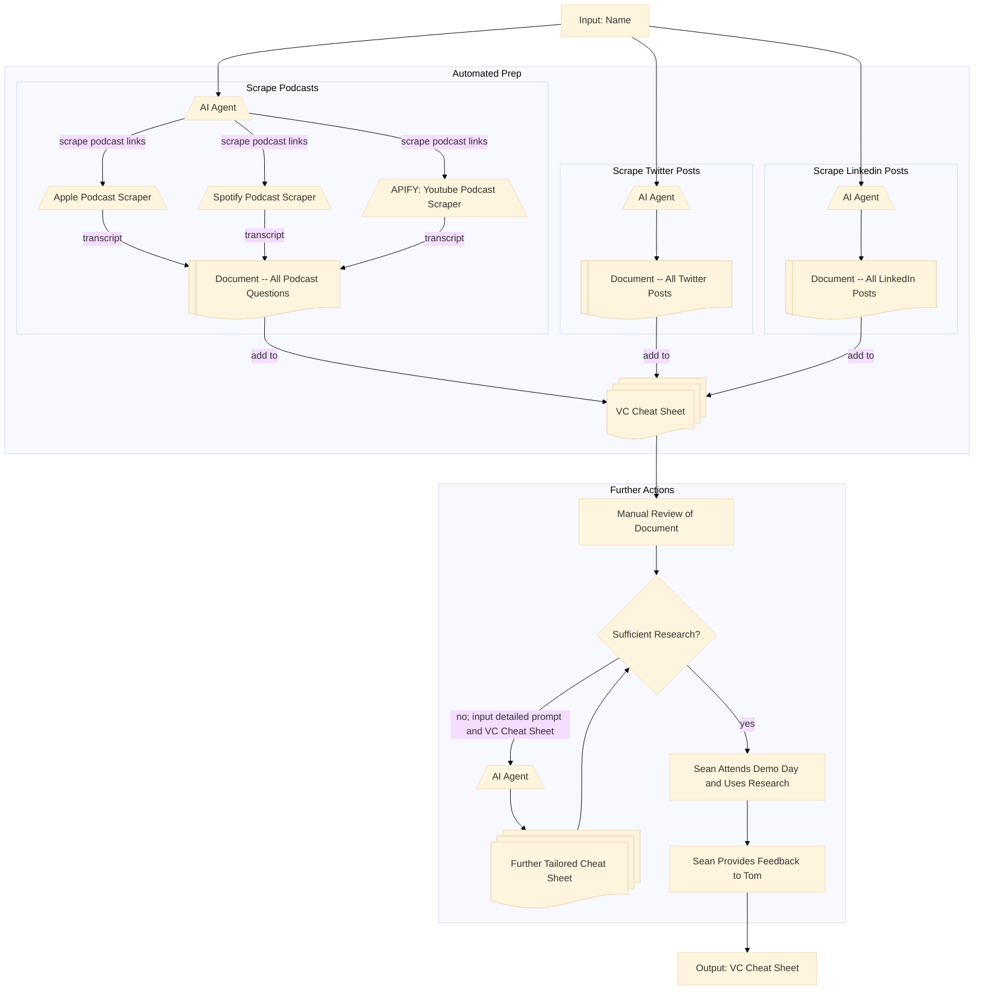

https://console.apify.com/actors/nfp1fpt5gUlBwPcor/runs/tZwiz4P0vYT1NkBlP#output

# Demo Day Guest Researcher
Generates in depth digital footprint on a person of choice.

Inputs: name of person
Outputs: document containing all recent viral posts LinkedIn and X Posts, all recent podcasts and transcripts

## workflow

# 